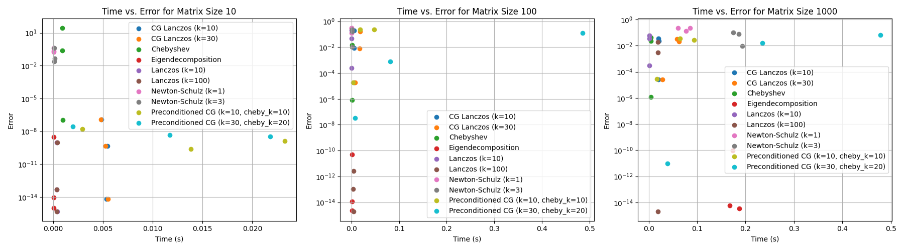

# Novel Solver for A^(1/2)x = b

This repository contains the implementation and benchmarking of solvers for the matrix equation A^(1/2)x = b, where A is a symmetric positive definite matrix.

## Solvers

Currently the following solvers are implemented in this repository:

1.  **Eigendecomposition**: This method computes the eigendecomposition of the matrix A to find its square root and then solves the system directly. It is accurate and robust but can be computationally expensive for large matrices.

2.  **Lanczos**: This is an iterative method for finding eigenvalues and eigenvectors of a symmetric matrix. In this repository, the Lanczos algorithm is used to approximate A^(-1/2)b.

3.  **Chebyshev**: This method approximates the function f(z) = z^(-1/2) with a Chebyshev polynomial, and then computes the solution as a matrix-polynomial-vector product. It can be more stable than Newton-Schulz for ill-conditioned matrices.

## Benchmarking

The solvers are benchmarked on a range of symmetric positive definite matrices with varying sizes and condition numbers. The following metrics are used for comparison:

*   **Execution Time**: The wall-clock time taken to solve the system.
*   **Relative Error**: The 2-norm of the difference between the computed solution and the true solution, divided by the 2-norm of the true solution.

A warm-start scenario is also benchmarked if it is supported by the solver. We obtain a new matrix equation by adding low rank correction to A and perturbing b. We then use the solver to solve this equation, and use the solution as a warm start.

## Results

The benchmark results are summarized in the plot below:

### Analysis

*   **Eigendecomposition**: This method remains the most accurate and is very fast for the matrix sizes tested.
*   **Lanczos**: The Lanczos method provides a good approximation for well-conditioned matrices, but its accuracy degrades significantly as the condition number increases.
*   **Chebyshev**: The Chebyshev solver is a competitive alternative to the other iterative methods. It is significantly faster than Eigendecomposition and Newton-Schulz for larger matrices. Its accuracy is comparable to Lanczos, and it is more stable than Newton-Schulz for ill-conditioned matrices.
